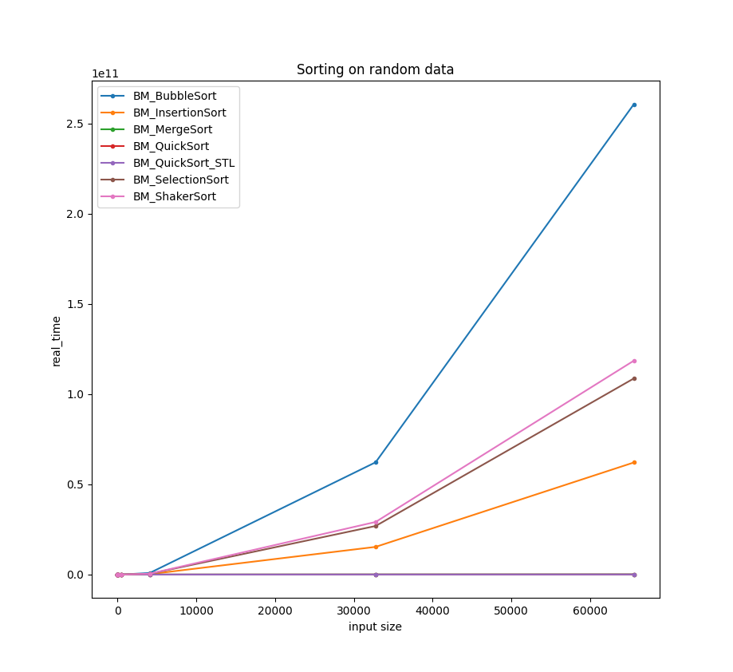
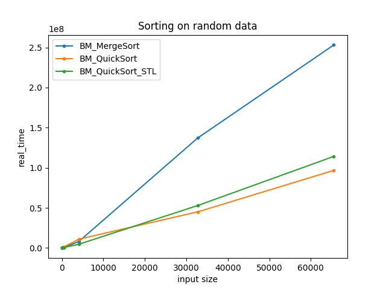
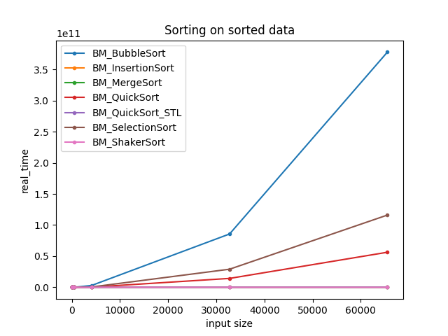
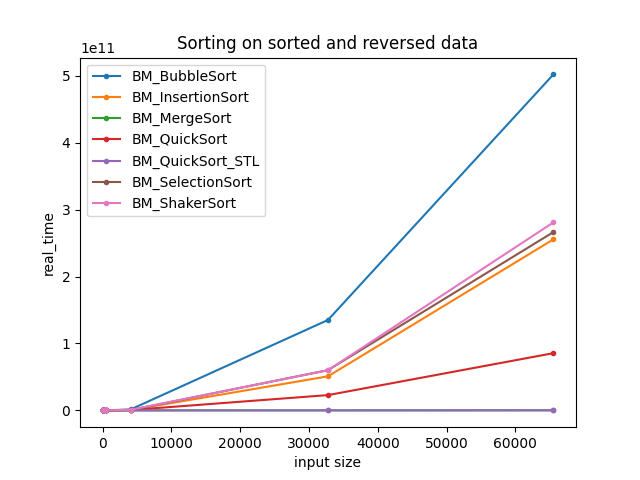
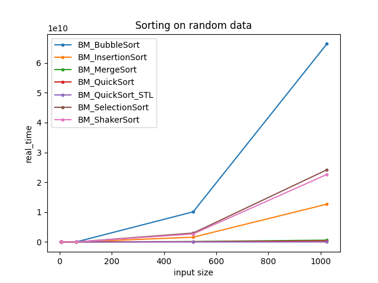
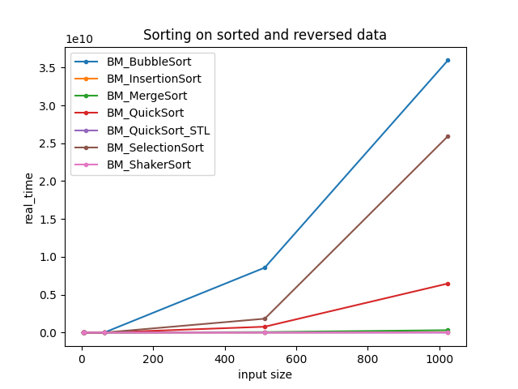
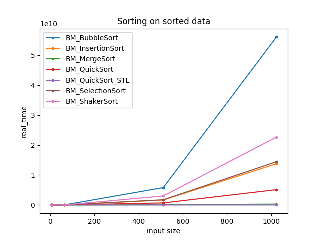

           
# Лабораторная работа №1

## **По курсу «Языки программирования и методы программирования»**

_Цель: написать алгоритмы сортировки и проанализировать их работу на различных данных._

Для реализации были выбраны:

- QuickSort (Метод Хоара)
- MergeSort (Метод нисходящим слиянием)
- BubbleSort (Метод пузырька)
- ShakerSort (Шейкерная сортировка)
- InsertionSort (Метод простых вставок)
- SelectionSort (Сортировка с помощью простого выбора)

## Бенчмарк

Был проведен бенчмарк всех алгоритмов. В качестве входных данных использовались массивы с различным наполнением:

- Массивы с рандомными данными
- Массивы отсортированные
- Массивы отсортированные и реверсированные

Также предоставляется выбор структуры данных. Данные берутся в диапазоне от $2^2$ до $2^{16}$ ввиду использования не очень мощного железа. В качестве платформы используется Google Benchmark. Поскольку даёт большое количество инструментов, таких как: измерения асимптотики, отключения оптимизации кода, вывод данных в json или csv и других. Графики строились с помощью скрипта на Python, который можно найти по пути ```lab1/script```.

## Анализ графиков

### ArraySequence





Сравнивались сортировки на случайных данных. Видно, что в таких случаях сортировки с асимптотикой в среднем $O(n*log(n))$ намного быстрее остальных. Заметно, что все медленные сортировки работают в среднем за $O(n^2)$. Интересно, что на некоторых случайных данных Quick Sort обходит STL Quick Sort, что, вероятно, связано с выбором опорного элемента.



Сортировка на отсортированных данных показывает, что Bubble sort и Selection sort не зависят от входных данных и всегда работаю за $O(n^2)$. Также здесь появляется проблема Quick sort, поскольку опорным элементам в алгоритме выбирается крайний левый, то сортировка отрабатывает за $O(n^2)$.



При сортировке на отсортированных данных в обратном порядке получаем, что все сортировки, кроме Merge Sort и STL Quick Sort, отрабатывают худший случай $O(n^2)$.

### ListSequence

Сортировка списков более трудоемкая задача с данными алгоритмами, поскольку доступ по индексу в связном списке осуществляется в среднем за $O(\frac{n}{2})$. Поэтому заметно, как сильно возросло время. При том, что тестирование проводилось на данных всего до $2^{10}$, а не до $2^{16}$.






## Тесты

Для всех методов были написаны тесты с полным покрытием граничных и некорректных значений. Для этого используются массивы с различными элементами, пустые массивы. Проверка проводится на различных структурах данных, а именно массивах и списках. К тому же проверяется работа с различными типами данных, в том числе и самописными. В качестве платформы используется Google Test.