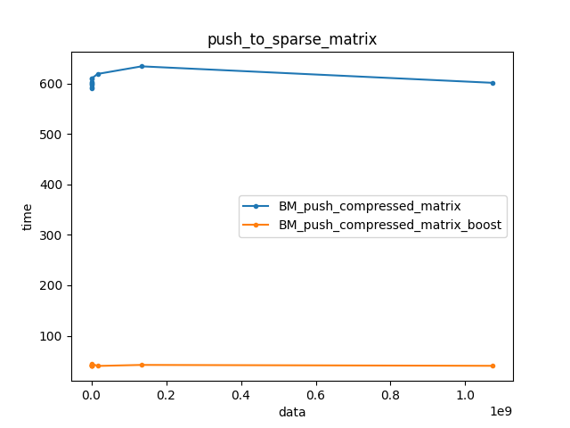
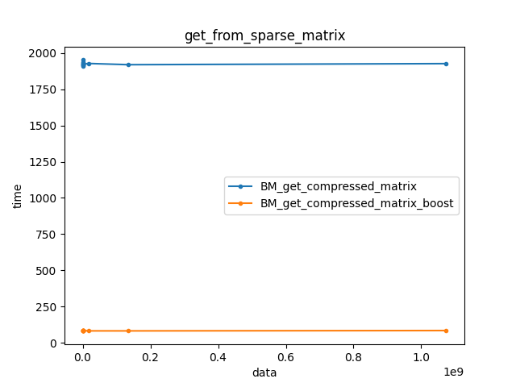

           
# Лабораторная работа №2

## **По курсу «Языки программирования и методы программирования»**

_Цель: написать программу на C++ для сравнения различных алгоритмов поиска_

Для реализации были выбраны:

- Задача о рюкзаке (однокритериальная задача с учетом формы предметов)
- Обработка разреженных векторов и матриц

## Задача о рюкзаке

В задаче было построено дерево решений, для этого использовалось n-арное дерево решений(исходники ```lab2/source/tree/TreeNodeVector.h```). Программа может работать, как с STL и Boost, а также и на реализованных ранее контейнерах, для работы с STL надо выбрать флаг ```-DDEBUG```. Также с этим флагом можно увидеть процесс подбора. Был реализован графический вывод с библиотекой SFML и OpenCV.

## Разреженные матрицы

В качестве реализации было выбрано АВЛ дерево. Заголовочные файлы находятся ```lab2/source/tree```. В написании использовались только контейнеры разработанные в предыдущих лабораторных работах (vector, который использует в свою очередь Sequence, queue для работу с деревом в ширину, однако pair используются из STL, так как никак не удалось запустить на своих), что также, возможно, повлияло на скорость.

## Тесты

Были написаны тесты с полным покрытием граничных и некорректных значений. В качестве платформы используется Google Test. Можно включить все тесты при компиляции с cmake параметром ```ctest```.

## Бенчмарк

Был проведен бенчмарк всех алгоритмов. В качестве платформы используется Google Benchmark. Поскольку даёт большое количество инструментов, таких как: измерения асимптотики, отключения оптимизации кода, вывод данных в json или csv и других. Графики строились с помощью скрипта на Python, который можно найти по пути ```lab2/script```.

## Графики



